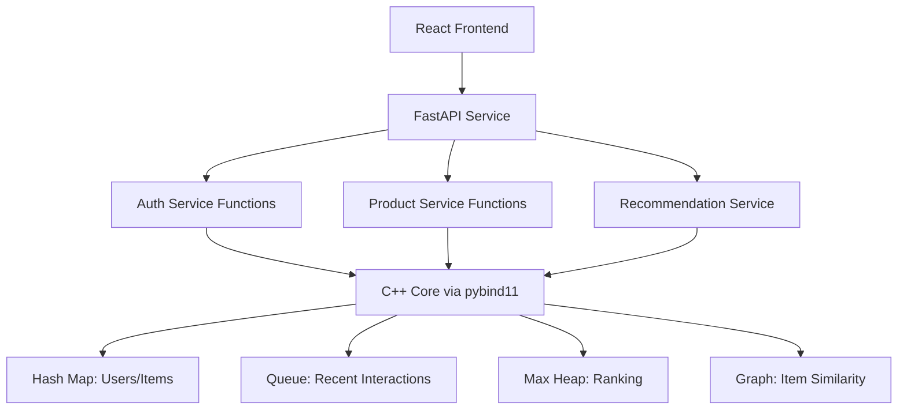

# BiteApple 🍎

## A Smart E-Commerce Recommendation Platform

**Course:** Applied Data Structures (University Project)  
**Milestone:** Milestone 1 (Data Structures + Architecture)

BiteApple is a recommendation-driven e-commerce simulation that demonstrates how core data structures can be engineered from scratch in C++ and applied to a real product-ranking problem. The platform tracks user behavior, maintains item popularity in real time, and returns either trending or personalized product recommendations.

This README serves two purposes:
- Technical documentation for implementation and integration.
- Presentation guide for Milestone 1 discussion.

---

## 1. Project Overview

### What problem this system solves
Modern e-commerce platforms must show relevant items quickly. Generic lists reduce engagement, while adaptive recommendations improve click-through, conversion, and user satisfaction.

BiteApple addresses this by combining:
- **Global popularity intelligence** for new users.
- **Behavior-aware personalization** for returning users.
- **Efficient ranking and lookup** using custom data structures.

### Why recommendation systems matter
- Reduce user decision fatigue.
- Improve discovery of useful products.
- Increase business metrics: views, cart additions, and purchases.
- Adapt continuously as user behavior changes.

---

## 2. System Architecture

### High-level architecture

```text
React Frontend (UI)
	|
	v
Python API Layer (FastAPI)
	|
	v
C++ Core Engine (Custom Data Structures + Recommendation Logic)
```

### Architecture rationale

#### Why C++ for the core
- Direct control over memory and implementation details.
- Strong fit for building data structures from scratch without STL.
- High performance for frequent inserts, updates, and ranking operations.
- Ideal for course objective: understanding internal mechanics, not just using built-ins.

#### Why Python for the API layer
- Fast and clean API development with FastAPI.
- Simple request validation and JSON serialization.
- Easy integration bridge between frontend and C++ engine.
- Supports rapid iteration during milestone phases.

#### How frontend communicates with backend
- React sends HTTP requests to FastAPI endpoints.
- FastAPI maps requests to C++ binding functions (via `pybind11` or equivalent binding layer).
- C++ engine processes state and returns results.
- FastAPI responds with structured JSON for UI rendering.

### Reference architecture diagram (Mermaid)



---

## 3. Full System Flow (Step-by-Step User Journey)

```text
1) User opens BiteApple website.
2) Frontend requests homepage data from API.
3) API asks C++ engine for global trending items (Max Heap top-K).
4) User signs up or logs in.
5) User browses and interacts (view, click, cart, purchase).
6) Each interaction is appended to Recent Activity Queue (FIFO).
7) Item/User records are updated in Hash Maps.
8) Item popularity scores are adjusted and reflected in Max Heap.
9) Recommendation engine fetches user history + similar items from Graph.
10) Engine merges popularity + similarity + recency signals.
11) API returns ranked personalized recommendations.
12) Frontend renders recommendations and continues feedback loop.
```

### New vs returning users
- **New user:** receives globally trending items from the heap.
- **Returning user:** receives personalized ranking using history + graph similarity + trending fallback.

---

## 4. Data Structures Design and Usage

All core structures are implemented from scratch in C++ (no STL containers).

### 4.1 Hash Map (Users & Items)

**Purpose**
- Store and retrieve user profiles and item records efficiently.

**Why this structure**
- Constant average-time lookup is critical for real-time recommendation updates.

**Internal behavior**
- Key hashing maps IDs to buckets.
- Collisions handled by chosen collision strategy in implementation (e.g., chaining/probing).
- Supports insert, search, update, and delete operations.

**System usage**
- `userId -> User profile/history`
- `itemId -> Item metadata/popularity stats`

**Complexity**
- Average: `O(1)` insert/search/delete
- Worst case: `O(n)` when collisions become extreme

### 4.2 Queue (Recent Activity)

**Purpose**
- Track recent user interactions in temporal order.

**Why queue (FIFO)**
- Recency matters in recommendation relevance.
- FIFO naturally models interaction stream: oldest events expire first.
- Supports time-decay and bounded history windows.

**Internal behavior**
- Enqueue new interaction events.
- Dequeue old events when buffer/window limit is reached.

**System usage**
- Maintain rolling recent activity for behavior analysis.
- Prioritize fresh interactions in recommendation scoring.

**Complexity**
- Enqueue: `O(1)`
- Dequeue: `O(1)`
- Front/peek: `O(1)`

### 4.3 Max Heap (Ranking System)

**Purpose**
- Keep highest-scoring items quickly accessible.

**Why heap over full sorting**
- Scores change frequently after every interaction.
- Heap supports efficient incremental updates and top-K retrieval.
- Full sorting every update is too costly for streaming behavior.

**Internal behavior**
- Parent score always greater than children in max-heap.
- Reheapify after insertion/update/removal to maintain order.

**System usage**
- Global trending feed.
- Ranking candidates inside recommendation pipeline.

**Complexity**
- Insert: `O(log n)`
- Extract max: `O(log n)`
- Peek max: `O(1)`
- Build heap: `O(n)`

### 4.4 Graph (Item Similarity)

**Purpose**
- Model relationships between items for recommendation expansion.

**Why graph**
- Similarity is relational by nature (item-to-item connections).
- Enables “users who viewed/bought X may like Y” logic.

**Internal behavior**
- Nodes represent items.
- Edges represent similarity/co-interaction strength.
- Traversal finds neighboring relevant items.

**System usage**
- Expand from items in user history to similar candidates.
- Blend graph candidates with popularity ranking.

**Complexity (typical operations)**
- Add edge/node: usually `O(1)` to `O(log n)` depending on backing structure
- Neighbor traversal: `O(deg(v))`
- Graph traversal subset: `O(V + E)` for BFS/DFS style scans

---

## 5. Integration Plan (Critical)

### Integration objective
Expose high-performance C++ recommendation logic to web clients through a maintainable API layer.

### Connection strategy
1. Implement C++ core classes/functions for auth, products, events, ranking, and recommendations.
2. Create Python bindings using `pybind11` (or equivalent C++/Python bridge).
3. Build FastAPI endpoints that call those bound functions.
4. Connect React frontend to FastAPI via REST.

### Function exposure model
- C++ exposes clean callable interfaces, for example:
  - `authenticate(email, password)`
  - `record_interaction(userId, itemId, actionType)`
  - `get_trending(limit)`
  - `get_recommendations(userId, limit)`

### API to C++ call mapping examples
- `POST /auth/login` -> calls `authenticate()` in C++
- `GET /products` -> calls product retrieval from C++ item store
- `GET /recommendations?userId=...` -> calls recommendation engine
- `POST /cart` -> records cart event and updates ranking signals

### Data contract style
- Requests/responses are JSON.
- FastAPI validates schema.
- C++ returns deterministic result structures converted to JSON-ready Python objects.

---

## 6. API Layer Design (Python / FastAPI)

### Why FastAPI
- High productivity with clear endpoint definitions.
- Built-in request validation and automatic docs generation.
- Async-friendly architecture for frontend integration.

### Role of Python in the stack
- Acts as **bridge and orchestration layer**.
- Converts HTTP requests into C++ function calls.
- Standardizes errors, validation, and response formats.

### Proposed endpoint set

```http
POST /auth/login
POST /auth/signup
GET  /products
GET  /recommendations?userId={id}
POST /interactions
POST /cart
```

### Endpoint responsibilities
- `/auth/login`: authenticate returning users.
- `/products`: list catalog or trending products.
- `/recommendations`: return ranked personalized items.
- `/cart`: update cart actions and behavioral signals.

---

## 7. Team Work Distribution (5 Developers)

### Developer roles
- **Developer 1:** Hash Map implementation (users/items storage).
- **Developer 2:** Max Heap implementation (ranking core).
- **Developer 3:** Queue implementation (recent interaction stream).
- **Developer 4:** Graph implementation (item similarity model).
- **Developer 5:** Integration, testing strategy, API layer, and documentation.

### Collaboration model
- Interface-first coordination between modules.
- Shared data contracts for user/item/interaction entities.
- Weekly integration checkpoints and test sync.

---

## 8. Testing Strategy

### 8.1 Unit testing (per data structure)
- Hash Map: insert, search, update, remove, collision handling.
- Heap: heapify correctness, top element validity, extract/insert behavior.
- Queue: FIFO ordering, empty/full edge cases, recency window behavior.
- Graph: node/edge insertion, neighbor retrieval, traversal correctness.

### 8.2 Integration testing
- Validate API endpoint to C++ function call chain.
- Confirm interaction events update internal structures correctly.
- Verify recommendation results reflect recent behavior changes.

### 8.3 System testing (user scenarios)
- New user receives trending feed.
- Returning user receives personalized feed.
- Cart/purchase actions influence ranking and recommendations.

### Example test scenarios
- HashMap: add 1000 users, ensure constant-time style lookup behavior.
- Heap: after mixed score updates, top-K remains correctly ordered.
- Queue: oldest interactions are evicted first when limit is reached.

---

## 9. Milestone 1 Deliverables

Milestone 1 focuses on foundation and design readiness.

- Core data structures implemented in C++ (no STL containers).
- Initial technical documentation completed.
- End-to-end architecture defined (React -> FastAPI -> C++).
- Integration approach and testing plan prepared.

---

## 10. What’s Next (Milestone 2 and Final)

### Milestone 2
- Implement recommendation engine scoring logic.
- Finalize Python-C++ binding layer.
- Connect frontend screens to live API endpoints.

### Final milestone
- Full system integration and hardening.
- Performance tuning and scenario-based evaluation.
- Deployment-ready demo with complete recommendation workflow.

---

## Presentation Notes (For Milestone 1 Discussion)

Use this walkthrough during presentation:
1. Start with the business problem and user impact.
2. Explain architecture and why each language is chosen.
3. Walk through full user journey pipeline.
4. Dive into each data structure and complexity trade-offs.
5. Show integration plan and endpoint mapping.
6. Conclude with testing strategy and milestone roadmap.

This structure demonstrates both theoretical understanding and practical system design.
